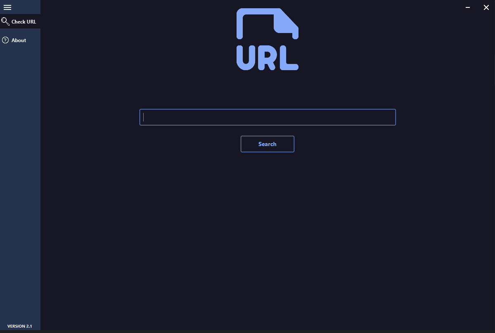
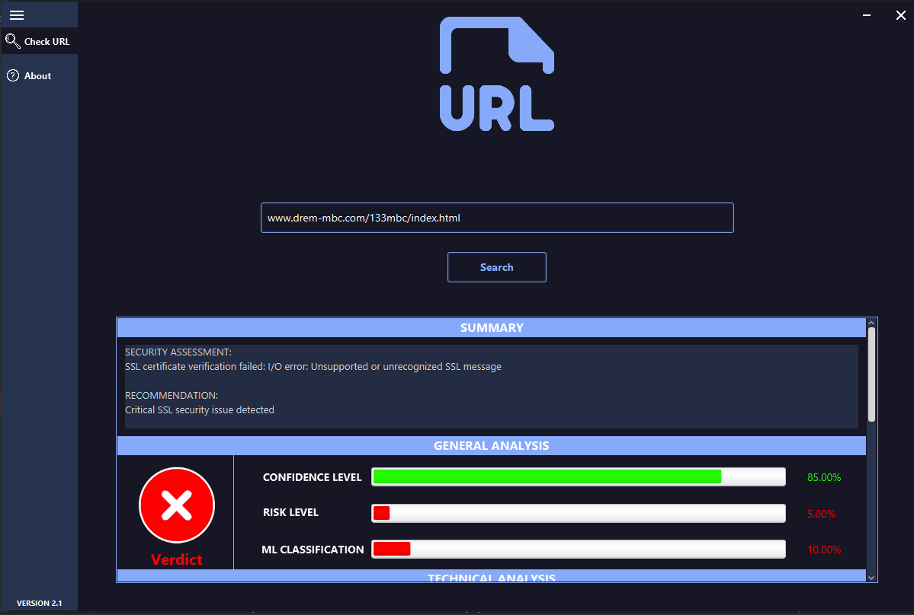

# URL Security Analyzer

A Java desktop application for comprehensive URL security analysis using machine learning, SSL certificate verification, and URL structure analysis to detect phishing and malicious websites.

## Features

- **Multi-layered Security Analysis**: Combines machine learning, SSL verification, and URL structure analysis
- **Machine Learning Classification**: Uses trained ML model to classify URLs as safe or malicious
- **SSL Certificate Verification**: Checks HTTPS, certificate validity, domain matching, and expiration
- **URL Structure Analysis**: Examines URL patterns for suspicious characteristics
- **Detailed Technical Reports**: Provides comprehensive security assessment with metrics and recommendations
- **Modern UI**: Clean, intuitive JavaFX interface with visual indicators and interactive elements

## Architecture

The application follows a layered architecture design:

- **User Interface Layer**: JavaFX controllers and view components
- **Processing Layer**: Coordinates analysis workflows
- **Analysis Layer**: Specialized security analysis components
- **Data Layer**: Results and model components

### Key Components

- **AppMain**: Core application class that manages initialization and navigation
- **AppController**: Controls the main UI and handles user interactions
- **URLProcessor**: Singleton that coordinates the URL analysis process
- **URLSafetyChecker**: Central security engine that combines multiple analysis techniques
- **URLValidator**: Validates URL format and existence
- **SSLVerificationService**: Verifies SSL certificate validity and properties
- **URLStructureAnalyzer**: Examines URL structure for suspicious patterns
- **URLClassifier**: Machine learning model for URL classification
- **URLFeatureExtractor**: Extracts features from URLs for ML classification

## System Requirements

- Java 11 or higher
- JavaFX 11 or higher
- Weka Machine Learning library
- 4GB RAM minimum (8GB recommended)
- 100MB free disk space

## Usage

1. Launch the application
2. Wait for the ML model to load (approximately 3 minutes on first run)
3. Enter a URL in the search bar
4. Click the "Search" button to analyze
5. View the security verdict and detailed analysis results
6. Use the side menu to navigate between pages

## Machine Learning Model

The application uses a supervised machine learning model trained on a dataset of legitimate and phishing URLs. The model extracts various features from URLs including:

* URL length
* Domain properties
* TLD information
* Character distribution
* Presence of suspicious keywords
* SSL certificate properties

## Technical Details

### URL Feature Extraction

The system extracts 13 different features from URLs:
* URL length
* IP address presence
* HTTPS usage
* Number of dots
* @ symbol presence
* URL depth
* Shortened URL detection
* Suspicious word detection
* Character encoding anomalies
* Domain entropy calculation
* Subdomain analysis

### SSL Certificate Validation

The SSL verification process checks:
* Certificate presence
* Validity period
* Domain name matching
* Self-signed status
* Issuer reputation
* Certificate chain integrity

### URL Structure Analysis

The structure analysis examines:
* Domain and subdomain patterns
* Path complexity
* Query parameter analysis
* Special character usage
* Brand name positioning
* Redirection techniques

## Acknowledgments

* Weka machine learning library
* JavaFX for the UI framework
* Machine learning datasets from PhishTank and Common Crawl
* Special thanks to all contributors

## Future Improvements

* Domain reputation checking
* Integration with browser extensions
* Expanded pattern recognition
* Incremental learning capabilities
* Export and sharing of analysis reports
